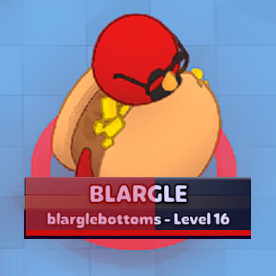

# PlateUp! Level Viewer

Makes the player info box at the bottom of the screen show your level (by appending to your username) and show your exp progress as a progress bar.

Note: At the moment, this is only visible (and probably updated) when switching profiles (or, if playing with controller, by pressing P briefly to start joining with keyboard.)

